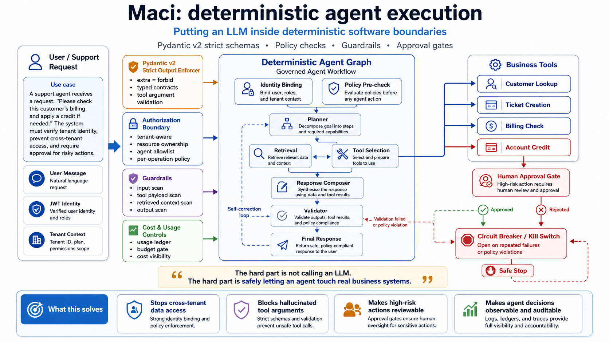
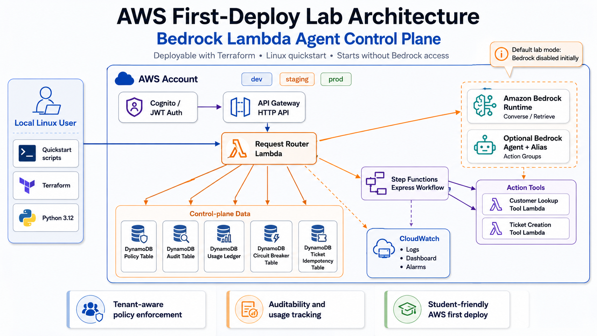

# MACI — Minimal Agent Control Infrastructure

**An AWS-native product-readiness use case for governed AI agents.**


Most AI agent demos look simple.

You take an LLM, add a system prompt, expose a few tools, and the agent can suddenly look up customers, check billing, create tickets, or suggest account credits.

That is enough for a proof of concept.

It is not enough for a product environment.

This repository demonstrates what changes when an AI agent moves from a PoC into a product-like system that operates near real customer data, tenant boundaries, billing workflows, approvals, audit logs, recovery requirements, and operational controls.

The goal is not to claim a universal agent platform.

The goal is to make the product-readiness gap visible.

MACI is also the public replica of control-plane patterns from private engagements in regulated environments. Where NDAs prevent showing the systems, this repository shows the engineering. The full case study, including design rationale and the regulatory mapping, lives at [dataandai.github.io](https://dataandai.github.io/#case-study).

---

## Sixty-Second Orientation

* **85 automated tests, all green, no AWS credentials required.** Every cloud call sits behind a mockable gateway. Includes a dedicated red-team layer for prompt injection, poisoned context, malicious tool output, and approval-bypass attempts.
* **Identity comes from the trust boundary, not the model.** Tenant context derives from validated JWT claims; a model asked to "act as tenant B" has no code path to do so.
* **Fail-closed contracts everywhere.** Strict Pydantic schemas with `extra="forbid"` on every request and tool.
* **Humans own the high-risk path.** Approval queue for money-moving actions; kill switches at global, tenant, agent, and tool scope; every agent has a revocable identity.
* **Audit that survives an incident review.** Per-tenant hash-chained audit events (DynamoDB `TransactWriteItems` chain head), redaction of secrets and PII, optional immutable archive.
* **Recovery is designed, not hoped for.** A recovery daemon with leasing and bounded retries resumes safe work and escalates ambiguous or high-risk state to humans.
* **Terraform-first AWS deployment** with CI security gates: tests, type checks, Bandit, pip-audit, Checkov, red-team asset verification.

The core rule of the whole system:

```text
The LLM proposes.
The system enforces.
```

Or in one sentence: the model may remain probabilistic; the operational boundary around it must be deterministic.

---

## The Use Case

Imagine a B2B SaaS or fintech-style company.

The company has enterprise customers. Each customer has its own tenant, its own users, its own data, its own support cases, and its own billing rules.

A support user asks an AI agent:

```text
Check this customer's billing issue, create a ticket, and apply credit if needed.
```

As a PoC, the question is simple:

```text
Can the agent call the right tool?
```

In a product environment, the question becomes much harder:

```text
Should this authenticated user, inside this tenant, through this agent,
be allowed to perform this action, on this resource, right now,
and can we audit, limit, recover, and explain it later?
```

That is the problem this repository explores.

---

## What This Repository Demonstrates

This project implements a product-readiness reference use case for governed agent execution on AWS.

It focuses on the control layers around an agent workflow:

* trusted identity from authenticated context;
* tenant isolation;
* per-operation authorization;
* resource ownership checks;
* strict tool schemas;
* guardrails;
* human approval for high-risk actions;
* account credit idempotency;
* conversation history;
* PII and secret redaction;
* audit trail and audit archive;
* usage and cost tracking;
* API Gateway throttling and AWS WAF;
* circuit breakers and kill switches;
* workflow state tracking;
* recovery daemon with leasing and bounded retries;
* prompt-injection and red-team test harness;
* CI security gates;
* Terraform-based AWS deployment path.

This is intentionally more than a chatbot skeleton, but it is still a reference implementation.

Different agent systems will need different policies, tools, compliance rules, recovery behavior, and data boundaries.

---

## High-Level Architecture



At a high level, the system looks like this:

```text
User / Support Console
        ↓
Cognito / OIDC / JWT
        ↓
API Gateway + WAF + Throttling
        ↓
Request Router Lambda
        ↓
Policy / Identity / Guardrail Boundary
        ↓
Agent Workflow
        ↓
Amazon Bedrock
        ↓
Tool Handlers
        ↓
DynamoDB / S3 / CloudWatch / Business Backends
```

A separate recovery path runs in the background:

```text
EventBridge Schedule
        ↓
Recovery Daemon Lambda
        ↓
Workflow State Store
        ↓
Lease / Backoff / Retry Policy
        ↓
Resume Safely or Escalate to Human Review
```

The model can request actions.

The system decides whether those actions are allowed.

The full AWS production architecture, including WAF, redaction, and the recovery daemon:



---

## Core Runtime Flow

A normal support workflow follows this pattern:

```text
1. User logs in through trusted identity.
2. Tenant context is derived from authenticated claims.
3. Request enters API Gateway.
4. WAF and throttling protect the entry point.
5. Request Router builds a trusted execution context.
6. Policy pre-checks run.
7. Input guardrails run.
8. The LLM plans the next step.
9. Tool call is requested.
10. Tool handler validates schema, policy, role, and resource ownership.
11. Read-only tools may execute if allowed.
12. High-risk tools create pending approval.
13. Human reviewer approves or rejects the exact operation.
14. Idempotency prevents duplicate execution.
15. Final response is validated.
16. Conversation transcript is stored.
17. Audit, usage, trace, and recovery state are written.
```

---

## Example: Account Credit

A support user asks:

```text
Check billing for customer cust-123 and apply credit if needed.
```

The agent may decide that it needs to:

```text
1. look up the customer;
2. check billing;
3. create a ticket;
4. request account credit.
```

The first three operations may be allowed under policy.

But account credit is a high-risk business action.

The agent cannot execute it directly.

Instead, the system creates a pending approval record tied to the exact payload:

```text
tenant
customer
amount
action
payload hash
approval status
```

Only after a human reviewer approves that exact operation can the account credit execution continue.

If the same approval is reused with a different amount, customer, tenant, or payload hash, the system rejects it.

---

## Conversation History vs Audit Trail

The system separates user-facing conversation history from security audit.

Conversation history answers:

```text
What did the user ask?
What did the agent answer?
Was a ticket created?
Is the credit pending or applied?
```

Audit trail answers:

```text
Who acted?
Which tenant was involved?
Which policy allowed or denied the action?
Which tool was requested?
Which resource was accessed?
Was approval required?
Was the action executed?
```

These are not the same thing.

Conversation history is for product experience and support continuity.

Audit trail is for accountability, security, and incident review. Audit events are hash-chained per tenant, so a removed or altered event breaks the chain and becomes detectable.

---

## Recovery and Restart Behavior

The runtime is allowed to be stateless.

The workflow state is not.

Workflow state, approvals, idempotency records, audit metadata, conversation metadata, and circuit breaker state are persisted.

If a workflow stops halfway, the recovery daemon can reconstruct what happened:

```text
Was the ticket already created?
Is account credit waiting for approval?
Was approval already granted?
Did the high-risk action execute?
Is the state ambiguous?
Can this be safely resumed?
Should it go to human review?
```

The recovery daemon does not execute high-risk business actions by itself.

It classifies workflows, claims them through a lease, applies bounded retry/backoff, and either resumes safe work or escalates ambiguous or high-risk states.

Known boundary: recovery covers MACI-owned workflow and conversation state. Cross-system compensation of half-completed transactions in external backends (CRM, billing, ticketing) remains an integration decision for the deployer. This is stated in [docs/limitations.md](docs/limitations.md) rather than hidden.

---

## Red-Team and Prompt-Injection Testing

The repository includes a dedicated red-team test layer separate from normal control-plane tests.

It covers channels such as:

* user prompt injection;
* poisoned retrieved context;
* malicious tool output;
* jailbreak-style attempts;
* approval bypass attempts;
* policy extraction attempts;
* benign false-positive controls.

The local red-team suite is deterministic and CI-friendly.

It can also be extended with exported public benchmark samples and run against a live dev/staging HTTP endpoint.

The goal is not to claim complete jailbreak immunity. Injection resistance stays probabilistic.

The goal is to test whether known adversarial text channels can bypass the application boundary, because that boundary is what limits the blast radius of a compromised agent: allowed tools only, own tenant only, within budget, with approval on the high-risk path.

---

## AWS WAF, Rate Limiting, and Redaction

The AWS deployment path includes API Gateway throttling and AWS WAF support.

This protects the entry point from basic abusive traffic patterns and known bad inputs.

The system also includes a redaction layer for conversations and audit events.

It redacts common sensitive data such as:

* bearer tokens;
* access tokens;
* refresh tokens;
* API keys;
* passwords;
* authorization headers;
* emails;
* phone numbers;
* IBAN-like values;
* card-like numbers with Luhn validation.

Token usage metrics such as `input_tokens` and `output_tokens` are preserved as numeric audit attributes.

This is important because cost and usage data should remain useful while secrets and PII are protected.

---

## Where This Maps to Regulation (Engineering View)

The controls in this repository are the engineering counterparts of obligations that teams deploying agentic AI in the EU are asked about. This is an engineering interpretation, not legal advice. Compliance certification remains the deployer's responsibility.

| Control | Where it lives | Obligation family |
|---|---|---|
| Hash-chained audit trail, redaction, archive | `audit.py`, `redaction.py` | Record-keeping and traceability (EU AI Act logging obligations) |
| Human approval, agent custodianship, scoped kill switches | approval flow, `policy_engine.py` | Human oversight, ability to intervene and interrupt |
| Threat model plus adversarial and red-team tests in CI | `docs/threat-model.md`, `tests/red_team/` | Risk management as living evidence |
| Fail-closed schemas, per-step guardrails | `schemas`, guardrail layer | Accuracy, robustness, cybersecurity |
| Tenant policy engine, resource ownership, isolation | `policy_engine.py`, `identity.py` | Data governance, GDPR-aware separation |
| Usage ledger, budget caps, circuit breakers | cost and circuit modules | Operational resilience (DORA-style expectations) |

If you are mapping a concrete deployment against article-level requirements, open an issue. Real-world mapping gaps drive the roadmap.

---

## CI/CD Security Gates

The repository includes CI checks for:

* Python tests;
* formatting and linting;
* type checking;
* Bandit security scan;
* dependency audit (pip-audit);
* Terraform format and validation;
* Checkov IaC scanning;
* red-team asset verification.

Security checks are intended to be real gates, not decorative log-only steps.

A production deployment should still add a proper promotion path:

```text
dev
  ↓
staging
  ↓
manual approval
  ↓
production
```

with Terraform plan review, drift detection, smoke tests, recovery tests, and red-team tests in the target environment.

---

## Local Validation

Install dependencies:

```bash
python -m venv .venv
source .venv/bin/activate
pip install -e '.[dev,aws]'
```

Run local validation:

```bash
python scripts/verify_redteam_assets.py
python -m compileall -q src tests scripts
pytest -q
```

Expected current local validation target:

```text
85 passed
```

Run only red-team tests:

```bash
pytest -q tests/red_team/
```

---

## AWS Deployment Path

The infrastructure is defined with Terraform.

Typical dev validation flow:

```bash
terraform -chdir=infra/terraform fmt -recursive
terraform -chdir=infra/terraform init
terraform -chdir=infra/terraform validate
terraform -chdir=infra/terraform plan -var-file=environments/dev/terraform.tfvars
terraform -chdir=infra/terraform apply -var-file=environments/dev/terraform.tfvars
```

A guided walkthrough from empty AWS account to smoke-tested API lives in [docs/aws-first-deploy-lab.md](docs/aws-first-deploy-lab.md).

Important:

This repository should not be treated as production-ready only because Terraform applies successfully.

A real deployment still needs:

* AWS account review;
* IAM least-privilege review;
* Bedrock model access validation;
* smoke tests;
* recovery tests;
* live red-team tests;
* monitoring and alerting;
* incident runbooks;
* real backend integration;
* compliance decisions;
* load and failure testing.

---

## Live Red-Team Testing

A live dev/staging endpoint can be tested with:

```bash
export MACI_REDTEAM_JWT="<test-tenant-jwt>"

python scripts/run_redteam_against_endpoint.py \
  --endpoint "https://<dev-api>/agent" \
  --manifest evals/redteam/dataset_manifest.example.json \
  --output redteam-live-report.json
```

Red-team override fields are protected by two gates:

```text
ENABLE_REDTEAM_OVERRIDES=true
REDTEAM_OVERRIDE_ROLES=redteam-operator,admin
```

This means a normal support user cannot use test-only red-team override fields, even in an environment where the override feature is enabled.

Production environments should keep red-team overrides disabled.

---

## Repository Structure

```text
src/maci/
  agent_tools/          Tool handlers
  audit.py              Audit event writer, hash chain, redaction integration
  conversation.py       Conversation transcript and metadata logic
  identity.py           Trusted identity and tenant context
  policy_engine.py      Authorization and request binding
  recovery.py           Workflow state and recovery daemon logic
  redaction.py          PII/secrets redaction
  redteam.py            Red-team dataset and runner logic
  request_router.py     Main request entry point

tests/
  red_team/             Prompt-injection and red-team tests
  ...                   Control-plane and recovery tests

evals/
  redteam/              Red-team dataset manifest and sample assets
  promptfoo/            Promptfoo example configuration
  garak/                Garak notes

infra/
  terraform/            AWS infrastructure modules and environments

docs/
  Architecture, deployment, recovery, security, red-team, and runbook docs
```

---

## Current Status

This repository is best described as:

```text
An AWS-native product-readiness reference use case for governed AI agent execution.
```

It is not yet:

```text
A fully production-certified enterprise platform.
```

If deployed and validated in a real AWS dev/staging account, it becomes:

```text
An AWS-validated product-readiness reference implementation.
```

That is still not the same as running on real customer data.

The remaining production steps include:

* real CRM/billing/ticketing integrations;
* proper tenant onboarding workflow;
* real load and soak testing;
* monitoring and alerting;
* incident response practice;
* compliance review;
* data retention and deletion workflows;
* production-grade CI/CD promotion;
* AWS disaster recovery decisions.

The honest boundary conditions are collected in [docs/limitations.md](docs/limitations.md), the threat model in [docs/threat-model.md](docs/threat-model.md), and the change history in [CHANGELOG.md](CHANGELOG.md).

---

## Related Work

MACI is one of three open reference implementations applying the same thesis at different layers:

* **Agents:** MACI (this repository)
* **Serving:** [AIBrix Tenant Gateway](https://github.com/dataandai/aibrix-tenant-gateway) — tenant policy gateway in front of AIBrix/vLLM
* **Analytics:** [Governed Text-to-SQL Agent](https://github.com/dataandai/governed-text-to-sql-agent) — governed natural-language analytics over BigQuery

Case studies for all three: [dataandai.github.io](https://dataandai.github.io/#case-study)

---

## What This Is Not

This is not:

* a universal agent runtime;
* a replacement for every agent framework;
* a complete enterprise platform;
* a guarantee of production readiness;
* a compliance certification;
* a claim that one architecture fits all agents.

It is a concrete use case showing the difference between:

```text
LLM + tools + demo
```

and:

```text
governed agent execution near real business systems
```

---

## Why This Exists

The agent itself is not the hard part anymore.

The hard part is everything around it:

* identity;
* authorization;
* tenant boundaries;
* safe tool execution;
* auditability;
* recovery;
* redaction;
* cost control;
* abuse protection;
* approval;
* operational visibility;
* CI/CD discipline.

This repository is a practical attempt to make that gap visible.

A PoC agent proves that the model can call a tool.

A product-ready agentic system must prove that the model can only call the right tool, for the right user, in the right tenant, on the right resource, under policy, with audit, recovery, limits, and human control where needed.

---

MIT License. Built and maintained by [Adam Feldmann](https://dataandai.github.io) ([LinkedIn](https://linkedin.com/in/adam-feldmann)).
